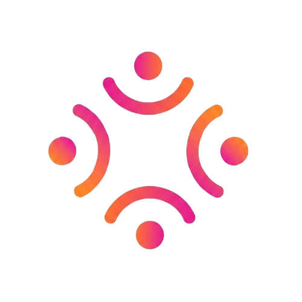

  

<h1 align="center">MesaPara4 — Web Oficial</h1>

  <b>El sitio web oficial y landing page de la app para conectar parejas con parejas.</b>

  
  

---

## 📌 Sobre el proyecto

Esta web actúa como la landing page oficial de **MesaPara4**. Está diseñada para presentar la app, captar a los primeros usuarios, ofrecer la guía de uso, facilitar vías de contacto y alojar toda la documentación legal requerida.

---

## 🛠️ Tecnologías utilizadas

- **HTML5 & CSS3:** Estructura y diseño adaptable.
- **JavaScript (ES6+):** Lógica e interacciones del sitio.
- **GitHub Pages:** Alojamiento y despliegue del sitio web estático.

---

## 📂 Páginas principales

| Página | Descripción |
| :--- | :--- |
| `index.html` | Landing page principal de presentación de la App. |
| `guia-de-uso.html` | Explicación detallada sobre el funcionamiento. |
| `empresas.html` | Información para locales y establecimientos colaboradores. |
| `apoya-el-proyecto.html` | Sección de apoyo e inversión/colaboración. |
| `contacto.html` | Formulario e información de contacto. |
| *Páginas Legales* | Privacidad, Cookies, Términos, Contratación y Desistimiento. |

---

## ⚖️ Licencia y Propiedad Intelectual

© 2026 **MesaPara4**. Todos los derechos reservados.

> Este código fuente, diseño, elementos gráficos y marca comercial pertenecen a sus respectivos autores. No está permitida la reproducción, distribución o modificación total o parcial de este repositorio sin autorización previa por escrito.